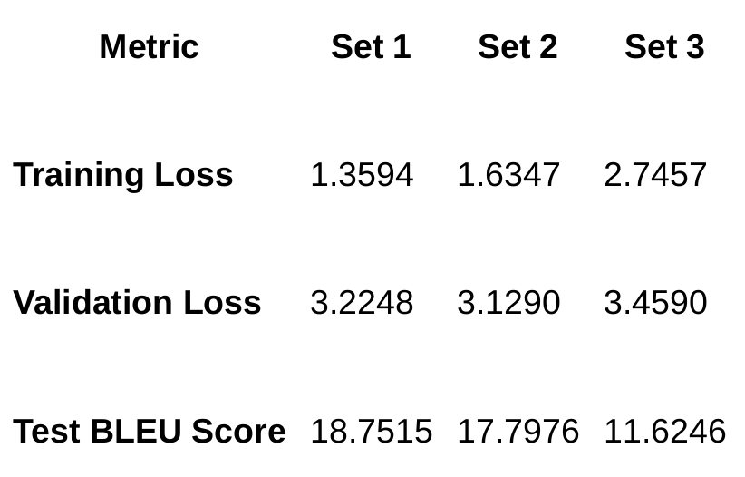
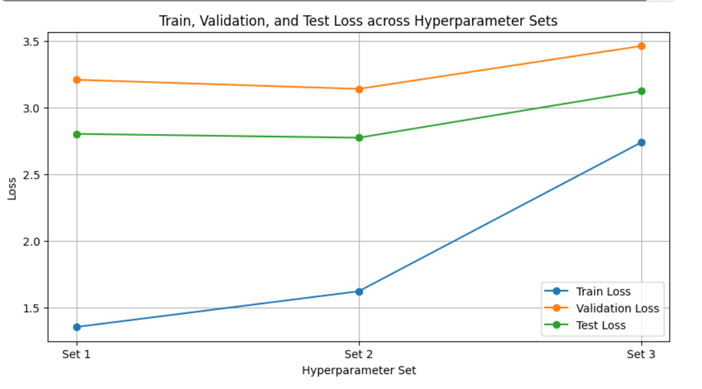
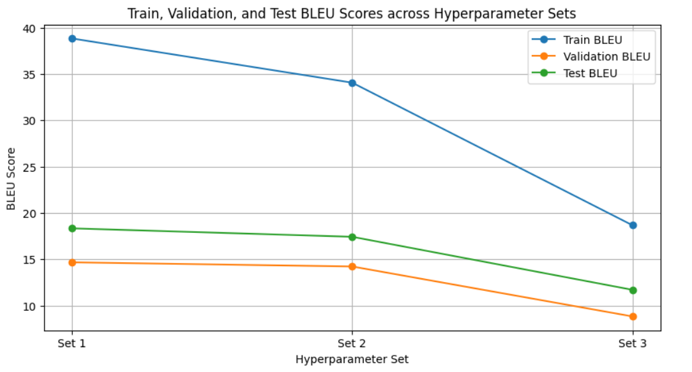

# Transformer Implementation from scratch for Machine Translation

## Implementation and training

### 1. Model Architecture

Designed the architecture of the transformer model from scratch for the task of machine translation. This includes all the components of the original transformer architecture.

### 2. Model Training

I have trained the transformer for the machine translation task. Dataset is a prallel corpus of English and French sentences for training this task. The corpus includes train, dev, and test splits.

The architecture of the Transformer model is governed by a set of hyperparameters that control various aspects of the model's complexity,capacity, and training dynamics. In this case, the following hyperparameters were used:

- **encoder_vocab_size and decoder_vocab_size:** These define
the size of the vocabulary for both the source (English) and target (French) languages. The vocab size affects the embedding layer and softmax output layers.

- **d_embed = 512:** This represents the dimensionality of the word
embeddings. Words in the input and output sequences are represented as vectors in a 512-dimensional space. This dimension needs to balance the complexity of the task with the computational resources.

- **d_ff = 512:** This is the size of the feed-forward network hidden
layer in the Transformer blocks. The feed-forward layer adds
additional non-linearity and transformation after the attention
mechanism.

- **h = 8:** The number of attention heads in the multi-head attention
mechanism. Multi-head attention allows the model to focus on different parts of the input sequence simultaneously. Here, 8 heads
were used, meaning the attention mechanism can capture different
relationships in parallel, contributing to richer representations of input tokens.

- **N_encoder = 3 and N_decoder = 3:** The number of layers in the
encoder and decoder stack. The model consists of 3 stacked encoder
layers and 3 decoder layers. These layers transform the input representation progressively. More layers increase the model's
capacity to learn complex patterns but may also lead to overfitting or
higher computational cost.

- **max_seq_len:** The maximum sequence length for input and output
sentences. This ensures that sequences are padded or truncated to a
fixed length for training. The model can efficiently process sequences
within this limit. 

- **dropout = 0.1:** Dropout is a regularization technique to prevent
overfitting by randomly setting 10% of the activations to zero during
training. This helps the model generalize better to unseen data.

The performance of the model was evaluated using the following key metrics:

- Training Loss: 1.3441
- Validation Loss: 3.1959
- Test Loss: 2.7879
- Training BLEU: 38.8874
- Validation BLEU: 14.2464
- Test BLEU: 18.9099

The CrossEntropyLoss is used to calculate the loss for the model, while the BLEU (Bilingual Evaluation Understudy)score is used to evaluate the quality of translations. The BLEU metric compares n-grams in the predicted translations to those in reference translations to determine how close the model's output is to the ground truth.

### 3. Analysis

**3.1 Training Loss vs. Validation/Test Loss:**

- The **training loss** is relatively low at 1.3441, indicating that the model is able to fit the training data well.
- The **validation loss** and **test loss** are higher at 3.1959 and 2.7879, respectively. This suggests a degree of overfitting, where the model performs better on the training data but struggles to generalize as well to unseen validation and test data.

The gap between the training and validation/test losses indicates that the model might be memorizing patterns from the training data rather than learning generalizable features. Techniques such as increasing dropout, using early stopping, or augmenting the data may help mitigate this
overfitting.

**3.2 BLEU Scores:**

- The **training BLEU** score is 38.8874, showing that the model generates translations that closely match the reference translations in the training set.
- However, the **validation BLEU** (14.2464) and **test BLEU** (18.9099) scores are significantly lower. These numbers suggest that the model struggles to generate high-quality translations for unseen data. Although the test BLEU score is better than the validation score, the model is still far from producing fluent or fully accurate translations in a real-world setting.

**3.3. BLEU Metric Considerations:**
The BLEU score, while commonly used, has limitations,particularly in evaluating language generation models.
A lower BLEU score doesn't necessarily mean that the model is generating poor translations; it may also be that the model is producing valid translations that differ from the reference translation in word choice or sentence structure.

For example, BLEU is sensitive to exact word matches, so variations in synonyms, paraphrasing, or stylistic differences might lead to a lower score even if the translation is semantically correct.

**3.4. Model Capacity and Complexity:**
The model has moderate complexity withN_encoder = 3 and
N_decoder = 3, and h = 8 attention heads. The embedding and
feed-forward dimensions (d_embed = 512, d_ff = 512) are typical for models of this type but could be further increased to improve performance. However, increasing model complexity might exacerbate overfitting unless more regularization or data augmentation techniques are used.

**3.5. Significance of Dropout:**
The dropout rate of 0.1 is on the lower end and might not be providing sufficient regularization for this model. Increasing the dropout rate could improve generalization and lower the validation/test losses, though this could slow down training or require longer training times.

### 4. Hyperparameter Tunning

In this analysis, we evaluate the performance of a Transformer-based
translation model across three different sets of hyperparameters. The
model’s performance is measured in terms of **training loss**, **validation loss**, and **BLEU scores** (for translation quality). The goal is to understand how changing key hyperparameters impacts the model’s ability to generalize and its overall translation quality.

**4.1. Hyperparameter Sets**

The following hyperparameter sets were tested:

- **Set 1:**
    - Number of encoder layers: 3
    - Number of decoder layers: 3
    - Number of attention heads: 8
    - Embedding dimension: 512 (so, d_embed ∕ h = 64)
    - Dropout: 0.1

- **Set 2:**
    - Number of encoder layers: 4
    - Number of decoder layers: 4
    - Number of attention heads: 12
    - Embedding dimension: 768 (so, d_embed ∕ h = 64)
    - Dropout: 0.2

- **Set 3:**
    - Number of encoder layers: 2
    - Number of decoder layers: 2
    - Number of attention heads: 8
    - Embedding dimension: 256 (so, d_embed ∕ h = 32)
    - Dropout: 0.3

**4.2. Results Overview**

The following results were obtained for each hyperparameter set:

**4.3. Analysis of Results:**

**4.3.1. Training and Validation Loss:**

- **Set 1** achieved the lowest training loss (1.3594), indicating that the model was able to fit the training data more effectively compared to the other sets.

- **Set 2** had a slightly higher training loss (1.6347), but its **validation loss** was the lowest among the three (3.1290). This suggests that **Set 2** may have better generalization ability despite not fitting the training data as tightly as Set 1.

- **Set 3** had the highest training loss (2.7457) and validation loss (3.4590), indicating underfitting. The lower number of layers and smaller embedding dimension in Set 3 might have restricted the model’s capacity to learn complex patterns in the data.

**4.3.2 BLEU Score (Translation Quality):**

- **Set 1** produced the highest **test BLEU score** (18.7515), showing that it was the most effective at generating translations that closely matched the reference translations.

- **Set 2** had a slightly lower BLEU score (17.7976), but it still performed competitively, especially considering it had better generalization (lower validation loss).

- **Set 3** had the lowest BLEU score (11.6246), which aligns with the higher losses observed. The lower capacity of the model (fewer layers and smaller embeddings) may have limited its ability to produce high-quality translations.

### 5. Pretrained Model

Drive link for transformer.pt file: https://drive.google.com/drive/u/0/folders/1tasZvyweI0k0CXiEgkVQF_zIR7Hh_utW

### 6. Text File (testbleu.txt)
 testbleu.txt file has bleu scores for all the sentences in the test set, printed in the format [sentence] [bleu_score]

